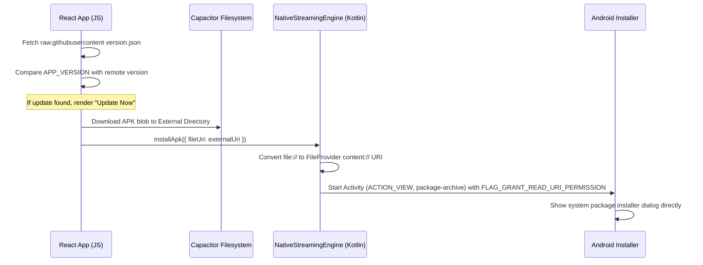

# CineMovie Native In-App Updater Guide

## 1. Native Installation Flow Architecture

To prevent redirecting the user to external web browsers or system file explorers when updating the application, CineMovie executes a native bridge installation flow:



---

## 2. Technical Implementation Details

### Native Kotlin Plugin Methods
The native bridge is registered inside `NativeStreamingEnginePlugin.kt`:

```kotlin
@PluginMethod
fun installApk(call: PluginCall) {
    val fileUriStr = call.getString("fileUri") ?: return call.reject("Missing fileUri")
    activity.runOnUiThread {
        try {
            val uri = android.net.Uri.parse(fileUriStr)
            val intent = Intent(Intent.ACTION_VIEW).apply {
                setDataAndType(uri, "application/vnd.android.package-archive")
                addFlags(Intent.FLAG_ACTIVITY_NEW_TASK)
                addFlags(Intent.FLAG_GRANT_READ_URI_PERMISSION)
            }
            
            // If it is a file scheme, convert it via FileProvider to content:// scheme
            if (uri.scheme == "file") {
                val file = java.io.File(uri.path ?: "")
                if (file.exists()) {
                    val contentUri = androidx.core.content.FileProvider.getUriForFile(
                        context,
                        "${context.packageName}.fileprovider",
                        file
                    )
                    intent.setDataAndType(contentUri, "application/vnd.android.package-archive")
                }
            }
            
            context.startActivity(intent)
            call.resolve()
        } catch (e: Exception) {
            call.reject(e.message)
        }
    }
}
```

### JS Service Integration
`updater.ts` handles chunk-based background downloads and triggers the plugin method:

```typescript
async function installApk(fileUri: string): Promise<void> {
  try {
    const { registerPlugin } = await import('@capacitor/core');
    const NativeStreamingEngine = registerPlugin<any>('NativeStreamingEngine');
    await NativeStreamingEngine.installApk({ fileUri });
  } catch (e) {
    console.error('Native APK installer call failed:', e);
    // Fallback if plugin fails
    const { Browser } = await import('@capacitor/browser');
    await Browser.open({ url: fileUri });
  }
}
```

---

## 3. Step-by-Step Guide: How to Release a New Version (Do NOT Forget)

Follow these exact steps when releasing a new version of the app (e.g. going from `0.7.0` to `0.8.0`):

### Step 1: Update Version Numbers in the Codebase
1. **`package.json`**: Update the `"version"` field (e.g., `"0.8.0"`).
2. **[updater.ts](file:///c:/Users/user/Desktop/CineMovie/src/services/core/updater.ts#L11)**: Update `APP_VERSION` string to match:
   ```typescript
   export const APP_VERSION = '0.8.0';
   ```
3. **[version.json](file:///c:/Users/user/Desktop/CineMovie/version.json)**:
   * Update the `"version"` field.
   * Update the filename in `"downloadUrl"` to match the new version name, e.g.:
     ```json
     "downloadUrl": "https://github.com/Extroos/CineMovie/releases/latest/download/Cinemovie.v0.8.0.apk"
     ```
4. **[build.gradle](file:///c:/Users/user/Desktop/CineMovie/android/app/build.gradle#L38)**: Update the gradle output filename version to match:
   ```groovy
   outputFileName = "Cinemovie.v0.8.0.apk"
   ```

### Step 2: Build the Production APK
Run the following build script to bundle all frontend assets and compile the native package:
```bash
npm run build:apk-release
```
* **Output APK Path**: `android/app/build/outputs/apk/release/Cinemovie.v[VERSION].apk`

### Step 3: Commit and Push Changes to GitHub
Stage and push your version config updates:
```bash
git add package.json version.json src/services/core/updater.ts android/app/build.gradle
git commit -m "chore: bump version to v0.8.0"
git push origin main
```

### Step 4: Create and Push the Release Tag
Tag the commit to prepare the GitHub release:
```bash
git tag v0.8.0
git push origin v0.8.0
```

### Step 5: Draft the GitHub Release and Upload APK
1. Go to your repository release panel: `https://github.com/Extroos/MovieTester123/releases`
2. Click **Draft a new release**, select the tag `v0.8.0`.
3. Give it a title (e.g. `Release v0.8.0`) and enter release notes.
4. Drag and drop the compiled APK (`Cinemovie.v0.8.0.apk` from your local build output path) into the upload container.
5. Click **Publish release**.

---

## 4. Android Security Configuration

* **FileProvider Configuration**: Mandatory inside `AndroidManifest.xml` under the `<provider>` section linking to `@xml/file_paths` to allow reading the external storage directory without triggering safety exceptions on modern Android versions (API >= 24).
* **Install Packages Permission**: The APK must request `<uses-permission android:name="android.permission.REQUEST_INSTALL_PACKAGES" />` in the Manifest to launch the package installer.
